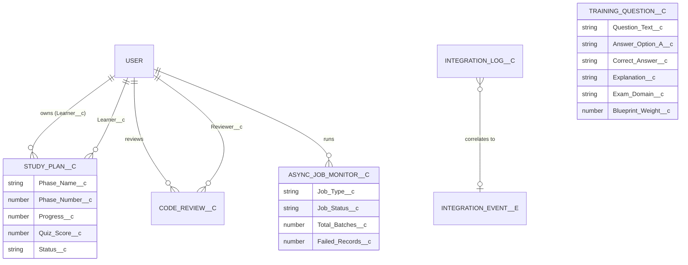
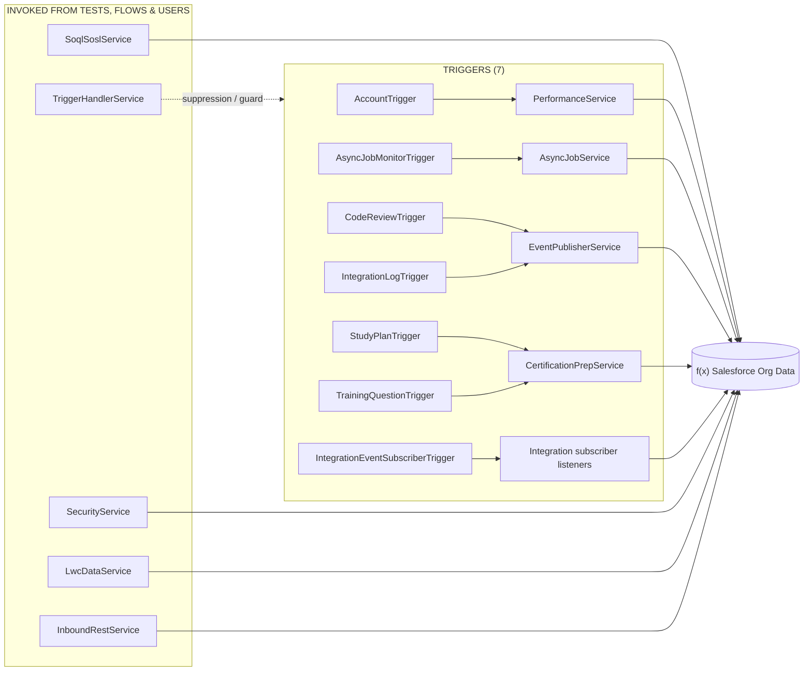
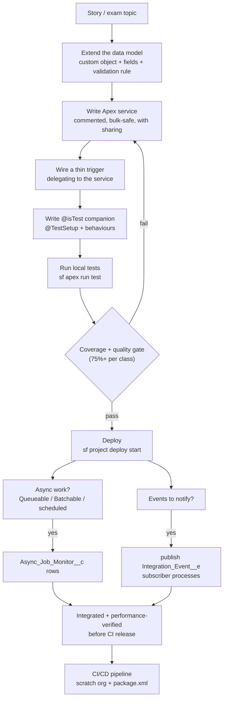
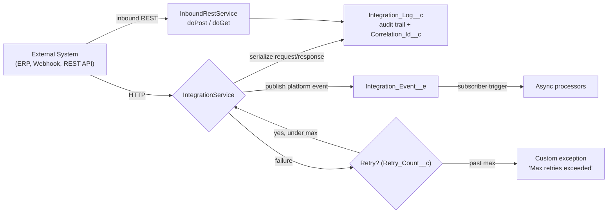
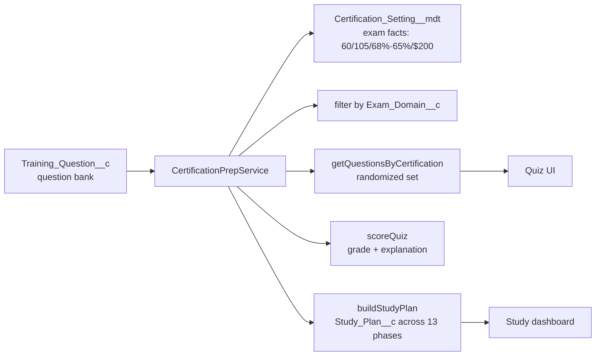

# 🏗️ Developer I & II RoadMap — Architecture

This document is a visual walkthrough of the system built across the 13 phases. All diagrams are [Mermaid](https://mermaid.js.org) and render natively on GitHub.

---

## 1. High-Level Architecture (Layered)

The project follows a **layered architecture**: Lightning Experience on top, automation in the middle, an Apex service layer doing the business logic, and clean, normalized data underneath.

```mermaid
flowchart TB
    subgraph UI["PRESENTATION"]
        UX["Lightning Experience — Developer Roadmap App"]
        DSB["Reports (2) & Dashboard (1)"]
        QUIZ["Certification Prep — Question Bank UI"]
        LWC["LWC Data Service Endpoints"]
    end

    subgraph AUTOMATION["AUTOMATION LAYER"]
        F[Flows (6)<br/>plan init, priorities, inbound flags, retries, completion]
        VR[Validation Rules (5)<br/>date & score bounds, answer validation]
        AR[Assignment Rules<br/>Lead + Case routing]
        AP[Approval Process<br/>Code review sign-off]
    end

    subgraph APEX["APEX LAYER (business logic)"]
        TRIGGERS["7 Triggers<br/>Account, AsyncJobMonitor, CodeReview, IntegrationLog,<br/>IntegrationEventSubscriber, StudyPlan, TrainingQuestion"]
        SERVICES["10 Service Classes<br/>Soql/Sosl, TriggerHandler, Performance, AsyncJob,<br/>EventPublisher, Security, Integration, LwcData,<br/>InboundRest, CertificationPrep"]
        AI["Integration_Event__e<br/>Platform Event"]
        CMT["Certification_Setting__mdt<br/>Custom Metadata"]
    end

    subgraph DATA["DATA LAYER"]
        STD["Standard Objects<br/>Account, Contact, Lead, Opportunity, Case,<br/>Task, Event, Campaign, User"]
        CUSTOM["Custom Objects<br/>Async_Job_Monitor__c, Integration_Log__c,<br/>Code_Review__c, Training_Question__c, Study_Plan__c"]
    end

    UX --> F
    UX --> VR
    UX --> AR
    UX --> AP

    F --> SERVICES
    VR --> DATA
    AR --> DATA
    AP --> SERVICES

    UX --> TRIGGERS
    TRIGGERS --> SERVICES
    SERVICES --> DATA

    SERVICES --> AI
    AI --> CMT

    DSB --> SERVICES
    QUIZ --> SERVICES
    QUIZ --> CUSTOM
    LWC --> SERVICES

    DATA --> DSB
    DATA --> QUIZ
```

> **Architecture principles used throughout:**
> - **Trigger-light / Service-heavy**: triggers only detect events; all logic lives in testable service classes.
> - **Bulk-safe**: every trigger iterates `Trigger.new` lists, never `for` loops with per-record DML.
> - **`with sharing`**: services enforce the security model.
> - **Re-entrant-safe**: a shared suppression framework prevents recursion (`TriggerHandlerService.suppress/restore`).
> - **Test-isolated**: every service has a `@isTest` companion using `@TestSetup`.

---

## 2. Data Model

Salesforce standard objects + the custom objects and their relationships. Custom fields extend each standard object (e.g. `Health_Score__c` on Account).



**Custom objects & their purpose:**

| Custom Object | Purpose | Used By |
|---------------|---------|---------|
| `Async_Job_Monitor__c` | Observability rows for each async job | `AsyncJobService` |
| `Integration_Log__c` | Audit trail for every inbound/outbound call | `IntegrationService`, `InboundRestService` |
| `Code_Review__c` | Code review tracking + approval | `EventPublisherService` |
| `Training_Question__c` | Mini question bank mapped to the blueprint | `CertificationPrepService` |
| `Study_Plan__c` | User study plans across the 13 phases | `CertificationPrepService` |
| `Integration_Event__e` (platform event) | Asynchronous integration notification | `EventPublisherService` |
| `Certification_Setting__mdt` (custom metadata) | Real PDI / PDII exam facts (config) | `CertificationPrepService` |

---

## 3. Trigger → Service Wiring

Every trigger delegates to exactly one service — no logic lives inside a trigger.



> **Note:** `TriggerHandlerService` is embedded in every trigger for `shouldRun` / `suppress` / `restore`. `SoqlSoslService`, `SecurityService`, `LwcDataService` and `InboundRestService` are invoked from tests, LWC clients, or the REST endpoint rather than object triggers.

---

## 4. End-to-End Developer Workflow

How a dev-tooling idea becomes a tested, released feature.



---

## 5. Integration Architecture (Phase 11)



---

## 6. Certification Prep Architecture (Phase 13)



---

## 7. Folder → Architectural Layer Mapping

| Roadmap folder | Layer |
|----------------|-------|
| `force-app/main/default/classes/` | Apex service + test classes |
| `force-app/main/default/triggers/` | Event detection (thin) |
| `force-app/main/default/flows/` | Declarative automation |
| `force-app/main/default/objects/` | Data model (fields, validation rules) |
| `force-app/main/default/approvalProcesses/` | Human-in-the-loop approvals |
| `force-app/main/default/assignmentRules/` | Routing (queues) |
| `force-app/main/default/reports/` + `dashboards/` | Analytics |
| `force-app/main/default/platformEvents/` + `customMetadata/` | Integration substrate |
| `force-app/main/default/permissionsets/` | Security / FLS |
| `developer Roadmap/` | Curriculum (13 phase guides) |
| `scripts/` | Practice queries + Apex snippets |
| `docs/` | Interactive study site (GitHub Pages) |